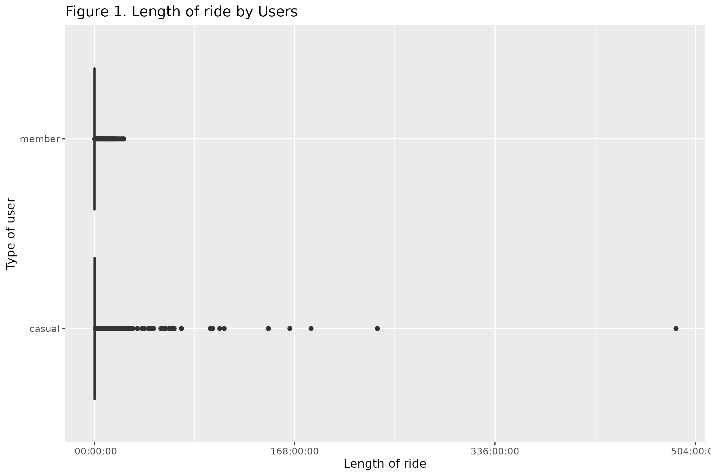
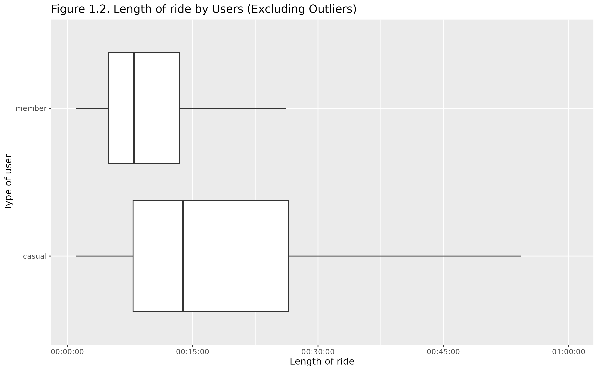
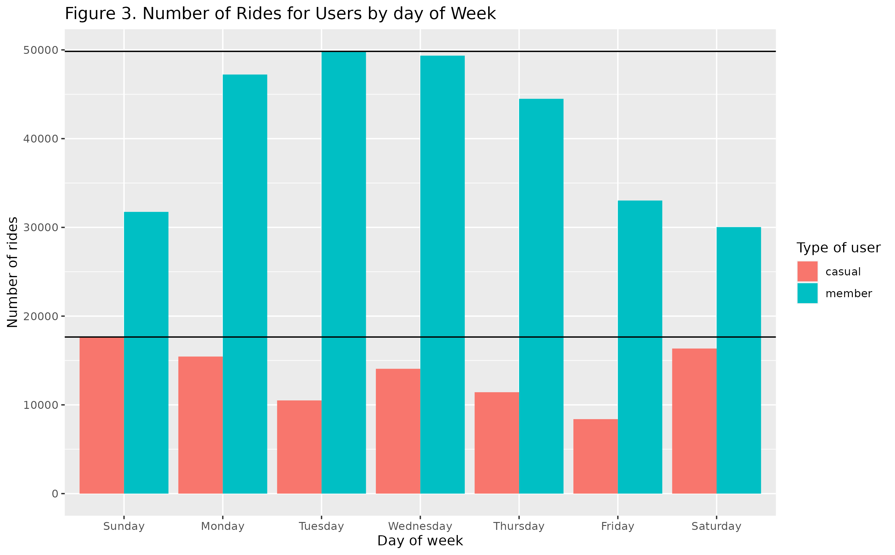
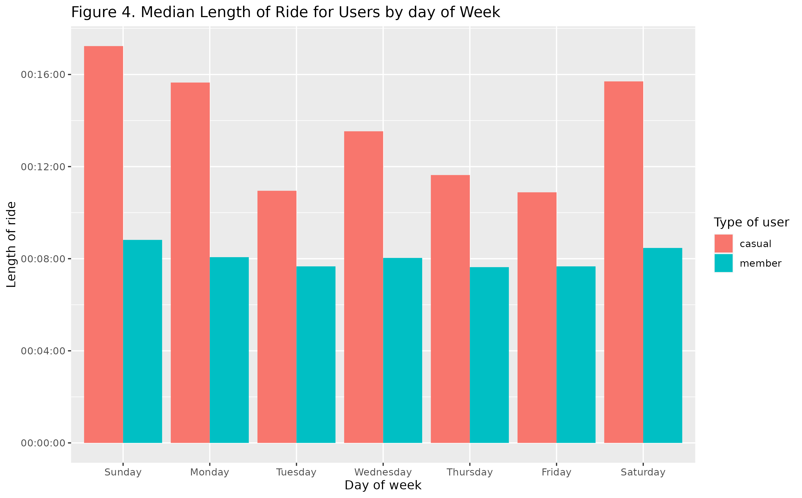

Cyclistic case Study (Google Data Analytic Certificate)
================
2023-11-29

## Scenario

This was a capstone project for [Google Data Analytic
Certificate](https://grow.google/certificates/data-analytics). In this
project, the scenario was a fictional bike-share company named Cyclistic
in Chicago with more than 5,800 bicycles and 600 stations. Customers
were either a casual rider, who purchases single-ride or full-day
passes, or a member who purchases annual membership. The director of
marketing believes that maximizing the number of annual memberships was
crucial for the future growth of the company. The task was to perform an
analysis to provide some insights for designing new marketing strategies
to convert casual riders to annual members.

## Objective

Identify any difference in length of rides between casual riders and
annual members when using Cyclistic bike.

## Tools

Tools used in this analysis were programming language R, [R
Markdown](https://rmarkdown.rstudio.com), and packages from
[tidyverse](https://www.tidyverse.org).

## Data Description

Cyclistic was a fictional company that does not have any real historical
data. To be able to make appropriate conclusions with real world data,
the dataset used in this analysis were from [public historical system
data of Divvy](https://divvybikes.com/system-data), a similar bike share
system in Chicago, under this
[license](https://divvybikes.com/data-license-agreement). This analysis
was focused on the system data collected in the first quarter (January -
March) of the year 2022.

The dataset contains 13 attributes:

- `ride_id` - Unique identifier of each ride
- `rideable_type` - Type of bike used in the ride. There were three
  possible types: `"electric_bike"`, `"docked_bike"`, `"classic_bike"`
- `started_at` - The time when the ride was started. Stored in a format
  `"%Y-%m-%d %H:%M:%S"` (`"yyyy-mm-dd HH:MM:SS"`)
- `ended_at` - The time when the ride was ended. Stored in a format
  `"%Y-%m-%d %H:%M:%S"` (`"yyyy-mm-dd HH:MM:SS"`)
- `start_station_name` - The name of the station where the ride was
  started
- `start_station_id` - Identifier of the start station
- `end_station_name` - The name of the station where the ride was ended
- `end_station_id` - Identifier of the end station
- `start_lat` - Latitude of the start location
- `start_lng` - Longitude of the start location
- `end_lat` - Latitude of the end location
- `end_lng` - Longitude of the end location
- `member_casual` - The type of users making the ride. There were two
  possible types: `"member"`, `"casual"`.

Three values were computed in this analysis:

- `ride_length` - Length of a ride in the format `"$H:$M:$S"`
  (`"HH:MM:SS"`)
- `dist` - Distance calculated with [Haversine
  Formula](https://en.wikipedia.org/wiki/Haversine_formula) between
  start station and end station in miles. The distance was **not** the
  total distance traveled in a ride.
- `day_of_week` - The day of week when the ride was started

After the dataset and libraries were loaded[^1], the dataset would be
filtered and cleaned.

## Filter the Data[^2]

As mentioned in the web page of [public historical system data of
Divvy](https://divvybikes.com/system-data), all rides with less than 1
minute in length would be filtered out as they may not be an actual bike
trip.

Also, after the `ride_length` and `dist` were computed, an unusual ride
was identified.

    # A tibble: 6 × 6
      ride_id    rideable_type start_station_name end_station_name ride_length  dist
      <chr>      <chr>         <chr>              <chr>            <time>      <dbl>
    1 332717241… electric_bike Pawel Bialowas - … Pawel Bialowas … 00:02:35    740. 
    2 306B59418… classic_bike  Lake Park Ave & 5… University Libr… 02:54:58     18.5
    3 9396D3E90… electric_bike NA                 NA               01:47:57     18.3
    4 9C018AC34… electric_bike NA                 NA               01:45:41     18.3
    5 05BF6B9B6… electric_bike Shore Dr & 55th St NA               01:34:29     18.2
    6 10B908977… electric_bike NA                 Kimbark Ave & 5… 02:03:50     17.9

There was a 2 minutes and 35 seconds bike trip that started and ended at
stations with id `"Pawel Bialowas - Test- PBSC charging station"` and a
distance of 739.96 miles between two stations. The ride was very
unlikely to be a normal ride made by a user and hence would be filtered
out. To filtered out similar observations, all rides that contains the
keyword `"test"` in their station id would be filtered out.

Finally, since Cyclistic bikes needed to be unlocked from a station and
returned to a station, all rides that had a start station id or end
station id would be filtered out.

After the filtering, all observations would have at least 1 minute in
length of ride and have a start station and an end station. Observations
like the one with station id
`"Pawel Bialowas - Test- PBSC charging station"` would not be in the
dataset.

## Clean the Data[^3]

There were some inconsistencies between station names and station ids.
First, there was a station id `444` that were assigned to two different
station names.

    # A tibble: 2 × 2
      start_station_name                 start_station_id
      <chr>                              <chr>           
    1 N Shore Channel Trail & Argyle Ave 444             
    2 N Shore Channel Trail & Argyle St  444             

However, both station names were referring to the same location.

    # A tibble: 6 × 4
      start_station_name                 start_station_id start_lat start_lng
      <chr>                              <chr>                <dbl>     <dbl>
    1 N Shore Channel Trail & Argyle Ave 444                   42.0     -87.7
    2 N Shore Channel Trail & Argyle Ave 444                   42.0     -87.7
    3 N Shore Channel Trail & Argyle St  444                   42.0     -87.7
    4 N Shore Channel Trail & Argyle St  444                   42.0     -87.7
    5 N Shore Channel Trail & Argyle St  444                   42.0     -87.7
    6 N Shore Channel Trail & Argyle St  444                   42.0     -87.7

For this analysis, the name `"N Shore Channel Trail & Argyle Ave"` would
be replaced with `"N Shore Channel Trail & Argyle St"`.

Likewise, there was a station name with more than one ids.

    # A tibble: 2 × 2
      start_station_name              start_station_id
      <chr>                           <chr>           
    1 Lakefront Trail & Bryn Mawr Ave KA1504000152    
    2 Lakefront Trail & Bryn Mawr Ave 15576   

For this analysis, Id `"KA1504000152"` was replaced with `"15576"`.

These inconsistencies also occurred between end station names and ids.

After cleaning the data, each station name would have a unique station
id.

## Analyze the Data[^4]

The focus of this analysis was the difference in length of ride between
members and casual riders and how they changed for different day of
week. \### Compared by Users

| member_casual | min      | Q1       | median   | Q3       | max       | mean     |
|---------------|----------|----------|----------|----------|-----------|----------|
| casual        | 00:01:00 | 00:07:29 | 00:13:10 | 00:24:51 | 572:34:04 | 00:31:54 |
| member        | 00:01:00 | 00:04:49 | 00:07:55 | 00:13:36 | 25:59:54  | 00:12:03 |

From the table, causal riders tended to have a longer ride than member
users. Likewise, there was a large difference between Q3 and the longest
ride for casual riders. Box plot in Figure 1 further illustrated that,
other than the longest ride, there were rides made by casual riders that
were much longer than the most of rides made by casual riders and
members.

As shown in Figure 2, when outliers were excluded, the length of rides
for casual riders were more spread out than members.

Based on the table and box plots, the members tended to have shorter and
more regular rides than the casual riders.

### Compared by day of Weeks

#### Number of rides

| member_casual | Sunday | Monday | Tuesday | Wednesday | Thursday | Friday | Saturday | total  |
|---------------|--------|--------|---------|-----------|----------|--------|----------|--------|
| casual        | 17646  | 15446  | 10501   | 14066     | 11425    | 8392   | 16349    | 93825  |
| member        | 31747  | 47225  | 49835   | 49353     | 44488    | 33026  | 30034    | 285708 |

As shown in the table and the bar plot in Figure 3, members tended to
made more rides during the weekdays and less during the weekends while
casual riders tended to made more rides during the weekends and less
during the weekdays. The highest number of rides made by members was
around Tuesday and Wednesday while the highest number of rides made by
casual riders was around Saturday and Sunday.

#### Length of Ride

Since the distributions of length of ride were skewed, the median of
length of ride by day of week would be used for analysis.

| member_casual | Sunday   | Monday   | Tuesday  | Wednesday | Thursday | Friday   | Saturday |
|---------------|----------|----------|----------|-----------|----------|----------|----------|
| casual        | 00:15:46 | 00:14:24 | 00:10:37 | 00:12:40  | 00:11:05 | 00:10:29 | 00:14:29 |
| member        | 00:08:27 | 00:07:52 | 00:07:29 | 00:07:50  | 00:07:27 | 00:07:30 | 00:08:11 |

 From the table and the bar
plot in Figure 4, the distribution for members was more uniform than the
distribution of casual riders. Length of ride for members did not varied
as much by day of week as the casual riders. Both casual riders and
members had their greatest median length of ride during the weekends.
Both tended to ride longer during the weekends.

## Conclusion

Members tended to have a more regular and shorter rides than casual
riders. Likewise, members tended to bike more during the weekdays while
casual riders tended to bike more during the weekends. One possibility
is that members might be more likely to use bikes for commute to work or
school than casual riders. However, more data and analysis would be
needed to prove or disprove this possibility.

[^1]: The dataset and packages used in this analysis were loaded with
    the script [load.R](./load.R).

[^2]: The filtering was done with the script [filter.R](./filter.R).

[^3]: Scripts [clean_start_station.R](./clean_start_station.R) and
    [clean_end_station.R](./clean_end_station.R) were used to clean the
    data.

[^4]: The scripts [analyze.R](./analyze.R) and
    [visualize.R](./visualize.R) are used to create the tables and
    plots.
